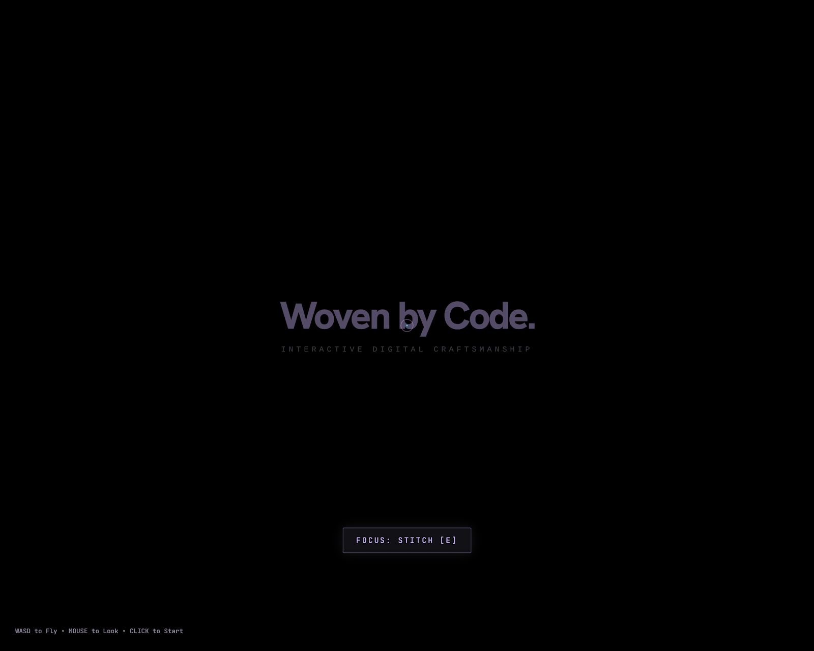
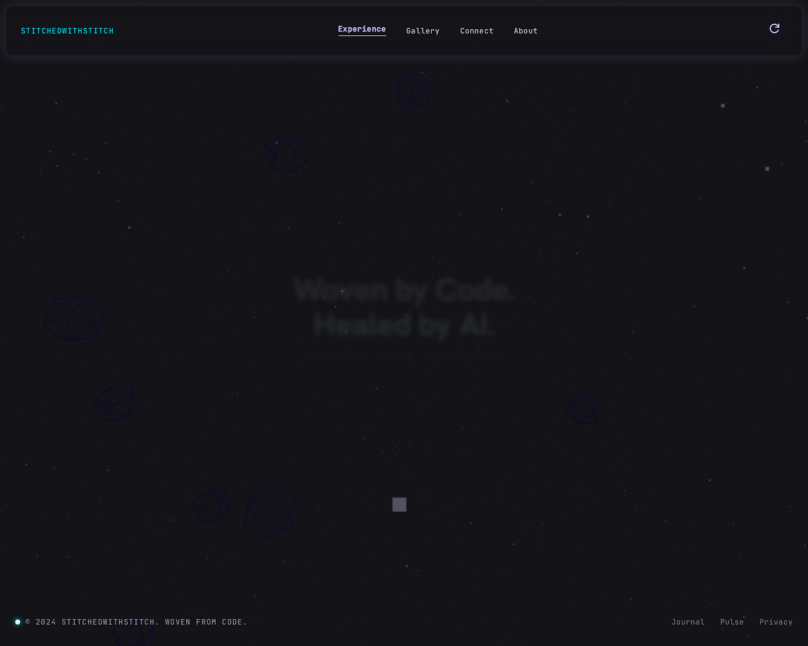
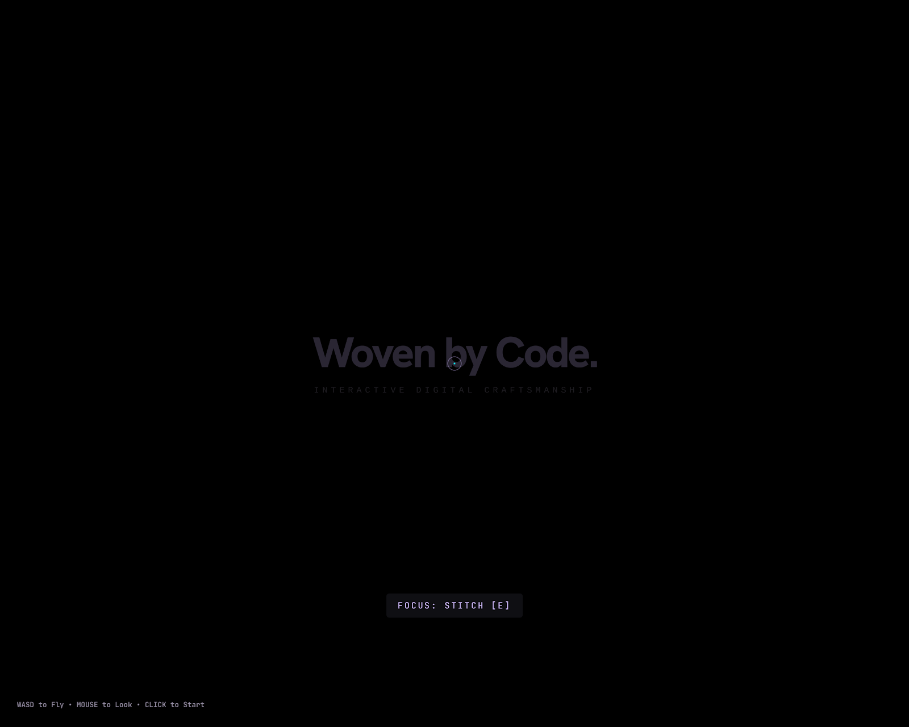

# stitchedwithstitch — Woven by Code

> An immersive, self-healing digital void built with Google Stitch and deployed to Netlify in one click.

**Live Demo:** [https://stitchedbystitch-wovenbycode.netlify.app/](https://stitchedbystitch-wovenbycode.netlify.app/)

---

## What This Is

`stitchedwithstitch` is a single-page, browser-native 3D universe that showcases how AI-assisted interface building can produce something alive, weird, and deeply interactive. There is no traditional navbar or footer — every UI element lives inside the Three.js world as a navigable object. You fly through a neon pixel nebula, discover 100 procedural void-dwellers, and trigger visceral digital glitches on proximity impact.

The project was created entirely inside **Google Stitch** through 7 iterative, streaming generations — from a basic living canvas to a full first-person exploration engine with absurdist dialogue, camera-shake recoil, and self-healing visual logic.

---

## Challenge Submission Overview

| Field | Details |
|-------|---------|
| **Theme** | Build interfaces that feel alive |
| **Challenge** | Google Stitch × Contra — June 2026 |
| **Live URL** | [stitchedbystitch-wovenbycode.netlify.app](https://stitchedbystitch-wovenbycode.netlify.app/) |
| **Video** | [`googlestitch_showcase.mp4`](./googlestitch_showcase.mp4) (37s, 1080p) |
| **Built with** | Google Stitch, Three.js, Tailwind CSS, Hanken Grotesk + JetBrains Mono |

> **Note:** Update the "Built by" and "Role" fields below with your info before submitting.

- **Built by:** Neal Frazier
- **Role:** Creative Technologist
- **Location:** Virginia Beach, Virginia
- **Background:** Self-taught via TryHackMe (cybersecurity) and freeCodeCamp (coding)

---

## What Was Built

### Core Experience
- **Three.js Immersive Environment** — A high-definition pixel-starfield with reactive wireframe geometries and parallax depth.
- **First-Person POV Flight** — WASD + mouse look controls with subtle inertia and weightless momentum.
- **100 Procedural Avatars** — Unique floating pixel-art entities, each with asynchronous "breathing" cycles and neon glow.
- **Absurdist Proximity Dialogue** — Avatars deliver deep-sounding but completely non-sequitur philosophical quotes paired with unrelated amazing facts when you approach them.
- **Self-Healing Engine** — A background process that restores visual order after chaos, reinforcing the "code-woven ecosystem" theme.

### Motion & Interaction
- **Pseudomorphic Noise Trails** — Electric cyan, magenta, and purple waves that trail behind your POV movement through the void.
- **Impact Glitch System** — Chromatic aberration, horizontal scanline jitter, RGB splitting, and camera-shake trigger on avatar proximity.
- **Cinematic Entry** — Staggered fade-and-scale transitions that draw you into the nebula as coordinates initialize.
- **Reactive HUD** — Minimal scanline glow focus indicator; dialogue text resolves from a digital glitch state into stable typography.

### Design System
The project follows the **Neon Pixel Synthesis** design system generated during the Stitch workflow:
- **Void Black** textured base (`#131318`)
- **Primary:** Deep Purple glow (`#d1bcff`)
- **Secondary:** Electric Cyan flow (`#d3fbff` / `#00eefc`)
- **Tertiary:** Neon Pink highlights (`#ffade1`)
- **Typography:** Hanken Grotesk for headlines, JetBrains Mono for technical metadata
- **Glassmorphism panels** with 12px backdrop blur and neon bloom glow states

---

## How I Used Stitch (Workflow)

This project was not planned in advance — it was discovered through iteration. Each step used Stitch's streaming generation and in-place editing to evolve the experience live on the canvas.

| Iteration | Prompt Goal | What Stitch Delivered |
|-----------|-------------|----------------------|
| **1. Living Void** | Create a self-healing one-page app with Three.js pixel art, noise-wave mouse trails, and no purpose other than showcasing code-as-art. | A dark canvas with reactive geometries and fluid color trails. |
| **2. Vibrant Trails** | Make noise trails more electric. | Neon spectrum (cyan, magenta, purple), luminous glow, enhanced persistence. |
| **3. Spatial Travel** | Let the user voyage through the world and discover floating information. | Scroll/drag navigation, parallax depth, floating data constellations. |
| **4. Diegetic UI** | Remove footer/navbar; turn them into Three.js world objects. Add FPS-style POV. | WASD + mouse flight, 3D navigation anchors, gamified focus indicator. |
| **5. The Inhabited Void** | Populate the world with 100 random avatars saying philosophical nonsense + unrelated facts. | 100 procedural avatars with proximity-based dialogue triggers. |
| **6. Animation Pass** | Add micro-interactions, transitions, and cinematic motion. | Staggered entry, breathing cycles, glitch-to-stable text resolution, flight inertia. |
| **7. Impact Glitch** | Amplify glitch effects on impact. | Chromatic aberration, scanline jitter, RGB split, camera-shake recoil, self-healing decay. |

### Key Stitch Capabilities Used
- **Streaming generations directly to canvas** — Each iteration appeared live without page reloads, letting me evaluate motion and color in real time.
- **In-place AI edits** — I refined the noise trails, added POV controls, and injected the avatar system by prompting directly on the evolving canvas rather than rewriting from scratch.
- **Native motion & animation on HTML canvas** — Stitch generated the full Three.js render loop, custom CSS keyframes, and post-processing glitch overlays as working code.
- **Netlify deploy integration** — One-click deployment from Stitch to [stitchedbystitch-wovenbycode.netlify.app](https://stitchedbystitch-wovenbycode.netlify.app/) with no manual build config.
- **Expanded import/export support** — The full project was exported as a working `.zip` containing every iteration, design tokens (`DESIGN.md`), and production-ready HTML.

---

## Motion, Interactivity & Technical Execution

- **Browser-native Three.js** — No bundler, no framework lock-in. Pure HTML + CDN Three.js + Tailwind.
- **Performance-conscious** — `requestAnimationFrame` loop with delta-time physics, 150-segment trail geometry with color buffer updates, and efficient proximity checks.
- **Accessibility consideration** — Fixed crosshair for orientation; keyboard controls mapped to both WASD and arrow keys; interaction prompts use high-contrast monospace text.
- **Responsive self-healing logic** — Glitch intensity decays via exponential falloff (`glitchIntensity *= 0.9`), creating a visceral but never permanently broken experience.

---

## Screenshots & Video

### Final Build — Glitch Impact Experience


### Home — Original Living Void


### The Inhabited Void — 100 Avatars


### Showcase Video
▶️ [`googlestitch_showcase.mp4`](./googlestitch_showcase.mp4) — 37-second 1080p walkthrough of the experience.

> **Tip for social sharing:** Upload this video to Loom, X, or LinkedIn as a 30-second clip showing POV flight, avatar encounters, and glitch impact.

---

## Feedback on Using Stitch

Coming from a self-taught background — grinding through TryHackMe labs and freeCodeCamp projects — I usually expect a lot of friction between idea and deploy. Stitch flipped that expectation.

**What surprised me most** was the streaming generation speed. I could type "make the noise trails more vibrant" and watch the canvas update live without losing the Three.js context or breaking the render loop. That is not how coding usually feels when you're self-teaching and constantly breaking your own builds.

**Streaming felt faster and more intuitive** than my normal workflow. Usually I write a prompt for myself, switch to VS Code, write code, refresh the browser, realize I broke the camera, and debug. With Stitch, the iteration happened inside the visual output. The 7 versions in this repo were generated in a single flowing session — not 7 separate coding sprints.

**What was clunky?** Fine-tuning the camera physics. Stitch nailed the broad strokes (WASD movement, flight inertia, glitch overlay) but dialing in the exact speed and lerp factor took a couple of "try again, slower" prompts. It is more of a sculptor's tool than a CAD tool — great for discovering form, but you still need patience on micro-tuning.

**Netlify deploy changed everything.** As someone who already loves Netlify for static hosting, having the deploy button inside Stitch meant I went from "this looks cool" to "this is live on a URL" in under a minute. No build config. No CLI. That is the difference between a portfolio piece that sits on localhost and one you can actually share.

**Would I use Stitch for a real client project?** Absolutely — for rapid prototyping, pitch decks, and experiential landing pages. For production backends or complex auth flows, I'd still reach for my traditional stack. But for anything where the user needs to *feel* something before they read anything, Stitch is now my first move.

---

## Social Sharing Checklist

To complete your submission, post to **X** and/or **LinkedIn** and tag `@stitchbygoogle`:

- [ ] Upload the 37s showcase video (trim to ~30s if needed)
- [ ] Write 1–2 sentences about what you built and how Stitch helped
- [ ] Include the live Netlify link: `https://stitchedbystitch-wovenbycode.netlify.app/`
- [ ] Tag `@stitchbygoogle`
- [ ] Submit your social links on the challenge page

**Example post:**
> Built "stitchedwithstitch" — a self-healing 3D void with 100 absurdist avatars — entirely in @stitchbygoogle. 7 streaming iterations from "make it alive" to "add glitch impact." Deployed to Netlify in one click. Live demo: [link] #StitchedWithStitch

---

## Project Structure

```
stitch_stitched_pixel_pulse/
├── stitchedwithstitch_home/                    # Iteration 1 — Living Void
├── stitchedwithstitch_immersive_experience_1/   # Vibrant trails
├── stitchedwithstitch_infinite_voyage/          # Spatial travel
├── stitchedwithstitch_immersive_experience_2/   # POV + diegetic UI
├── stitchedwithstitch_the_inhabited_void/       # 100 avatars
├── stitchedwithstitch_immersive_experience_3/   # Animation + transitions
├── stitchedwithstitch_glitch_impact_experience/ # Final — Impact glitch
├── stitchedwithstitch_living_void_experience/   # Alternate take
└── neon_pixel_synthesis/
    └── DESIGN.md                                # Full design system tokens

/googlestitch_showcase.mp4                       # 37s submission video
/stitchedwithstitchedprompts                     # Complete prompt log
```

---

## License & Attribution

This is original work created during the Google Stitch × Contra challenge window (June 2026). No external IP is used beyond fair-use open-source libraries (Three.js, Tailwind CSS) and Google Fonts.

---

*Built with curiosity, chaos, and Google Stitch.*
